<!--
_class: lead gaia
_paginate: false
-->
# OSTree 简介

---
<!-- backgroundColor: white -->
## 目录

- 软件分发
  - 包管理器
- 应用解决方式
  - SCLs
  - Container
- 操作系统解决方式
  - Active-backup
  - rpm-ostree(OSTree)

---


## 包管理器（RPM）

解决问题：
* 指定软件分发标准
  * 元数据存储包版本、大小、说明...
  * 安装、卸载、升级、校验...
* 将源代码打包成二进制软件包
* 自动查找依赖
* ...

---

## 包管理器（RPM）

存在问题：
* RPM 大部分只能更新，不能回滚
* 依赖关系管理，对系统的基础包依赖导致系统更新困难
* 不同的发行版之间切换几乎不可能
* 使用RPM部署复杂应用困难
* RPM 编写规则不友好

---

## 应用解决方式 - SCLs

Software Collections： https://www.softwarecollections.org/en/

RedHat 针对包管理器存在问题，提出了 SCLs 概念，使用SCL，可以在系统上构建并同时安装相同软件的多个版本。SCL 不会对系统已有软件产生影响。

---
## 应用解决方式 - SCLs

解决问题：
* 不需要修改 RPM 本身（修改 spec 文件）
* 不会覆盖修改系统文件，/opt/rh/<version>/root （不影响系统更新）
* 可以依赖其他 SCL 
* 允许同时存在多个版本，可按需卸载
---
## 应用解决方式 - SCLs

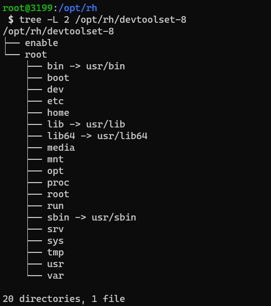

---

## 应用解决方式 - SCLs

存在问题：
* 依赖发行版（RHEL，CentOS，Fedora...）不同的发行版之间切换几乎不可能
* 使用RPM部署复杂应用困难
* RPM 编写规则不友好


---

## 应用解决方式 - Container

解决问题：
* 不会覆盖修改系统文件，container image 
* 不依赖特定发行版
* 允许同时存在多个版本 container image
---

## 应用解决方式 - Container

存在问题：
* container 生命周期管理， Kubernetes 
* 安全问题，大部分 container image 都存在各种 CVE


---
## 操作系统

如果所有的应用都以 container 运行，那操作系统还运行着什么？

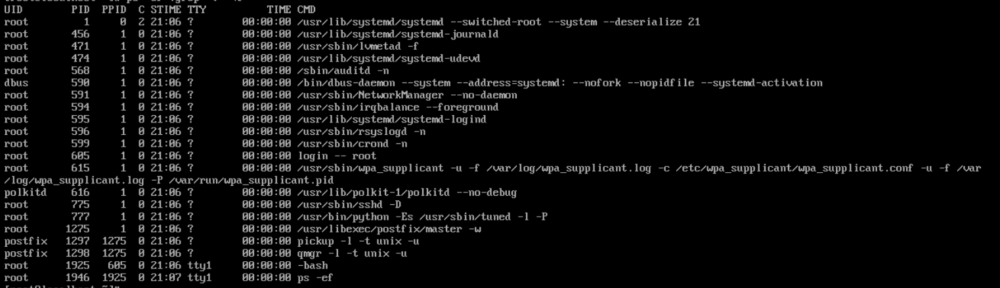

---

## OS 安装方式

不同的 Linux 发行版有不同的安装器进行安装：
* Redhat - Anaconda
* Ubuntu - Preseed
* Photon - photon-os-installer
* ...

---

## OS 升级方式 - 包管理器

所有应用都运行在 Container 中，Host OS 仍可能安装部分软件，比如 Debug、硬件驱动等。

存在问题：
* 更新依赖问题
* 回滚困难
* 随着软件包增多，测试成本增加
---
## OS 升级方式 - Active-Backup 

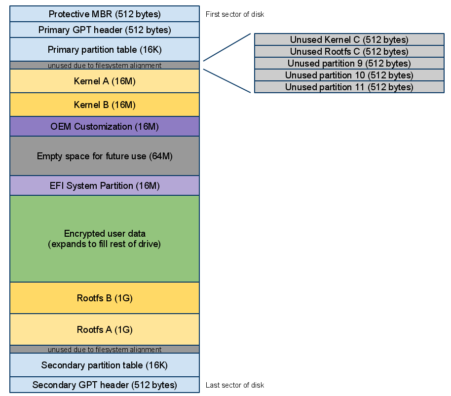
Active-Backup，系统中同时存在多个 rootfs，始终只有一个在工作（Active），一个在闲置（Backup），当系统更新时，将完整 rootfs 写入到 Backup 中，重启生效。

---
## OS 升级方式 - Active-Backup 
解决问题
  * 原子更新
  * 目标版本（状态）明确

---
## OS 升级方式 - Active-Backup  

存在问题
  * 分区固定，需要衡量根分区大小
  * 需要多个 rootfs 对应分区，浪费空间
  * 需要重启生效
  * 每次下载完整的 rootfs ，升级动作耗时长


---
## OS 升级方式 - rpm-ostree(OSTree)
https://ostreedev.github.io/ostree/

* 基于 OSTree 
    * "git for OS" 
    * 原子升级，支持回滚 
    * 允许在多个 rootfs 之间切换
    * 不可变文件系统
* 使用 RPM 构建 rootfs
* Package Layer ： 支持通过 `rpm-ostree install` 安装 RPM

---
## OS 升级方式 - rpm-ostree(OSTree)
解决问题：
* 原子更新
* 单一 repo 存储多个 rootfs
* 增量更新

---
## OS 升级方式 - rpm-ostree(OSTree)
存在问题：
* 需要重启生效
* 文件系统只读(除 /var 和 /etc)


---
## rpm-ostree 安装

支持 OStree 安装器：
* Anaconda
* photon-os-installer 
* ...

---
## rpm-ostree 安装
安装流程：
* 初始化 OSTree FS： `ostree admin --sysroot=/ init-fs `
* 初始化 OS： `ostree admin --sysroot=/ os-init "photon"`
* 部署指定 deployment：`ostree admin --sysroot=/ deploy --os=photon $repo_ref`
* 创建临时文件：/var/home/, /var/opt/
* 配置 Grub, 生成 fstab 
* chroot


--- 
## rpm-ostree 启动

The Boot Loader Specification： 
https://systemd.io/BOOT_LOADER_SPECIFICATION/

Dracut:
https://github.com/ostreedev/ostree/blob/master/src/boot/dracut/module-setup.sh

```
install() {
    dracut_install /usr/lib/ostree/ostree-prepare-root
    inst_simple "${systemdsystemunitdir}/ostree-prepare-root.service"
    mkdir -p "${initdir}${systemdsystemconfdir}/initrd-root-fs.target.wants"
    ln_r "${systemdsystemunitdir}/ostree-prepare-root.service" \
        "${systemdsystemconfdir}/initrd-root-fs.target.wants/ostree-prepare-root.service"
}
```

---

## rpm-ostree 升级与回滚

升级
* /etc/ 在升级过程中采用三路合并(3-way merge) `ostree admin config-diff`
    - 将当前的 /etc/ 文件与 base rootfs 中的 /usr/etc 比较，保留发生变化的部分
    - 当前 /etc/ 中没有修改过的配置，更新为目标版本 /usr/etc/ 的配置
* /var/ 不被修改

回滚：  `rpm-ostree rollback`


---
<!-- backgroundColor: -->
<!--
_class: lead gaia
_paginate: false
-->
# Demo


---
<!-- backgroundColor: white -->
## SCLs

```
centos7 SCLs 
查看 devtoolset-8
ls /opt/rh/
less /opt/rh/devtoolset-8/enable
tree /opt/rh/devtoolset-8/root -L 1
安装 devtoolset-9 
yum install devtoolset-9
ll /opt/rh/
find devtoolset-8 -name "*gcc"
find devtoolset-9 -name "*gcc"
```
---
## Active-Backup

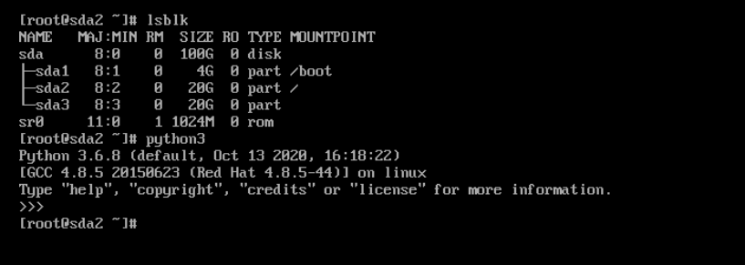

---
## Active-Backup

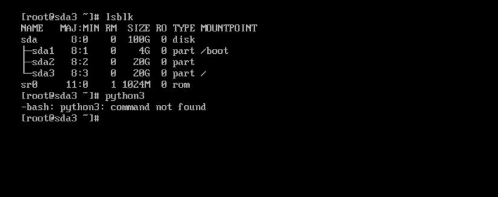

---

## OSTree

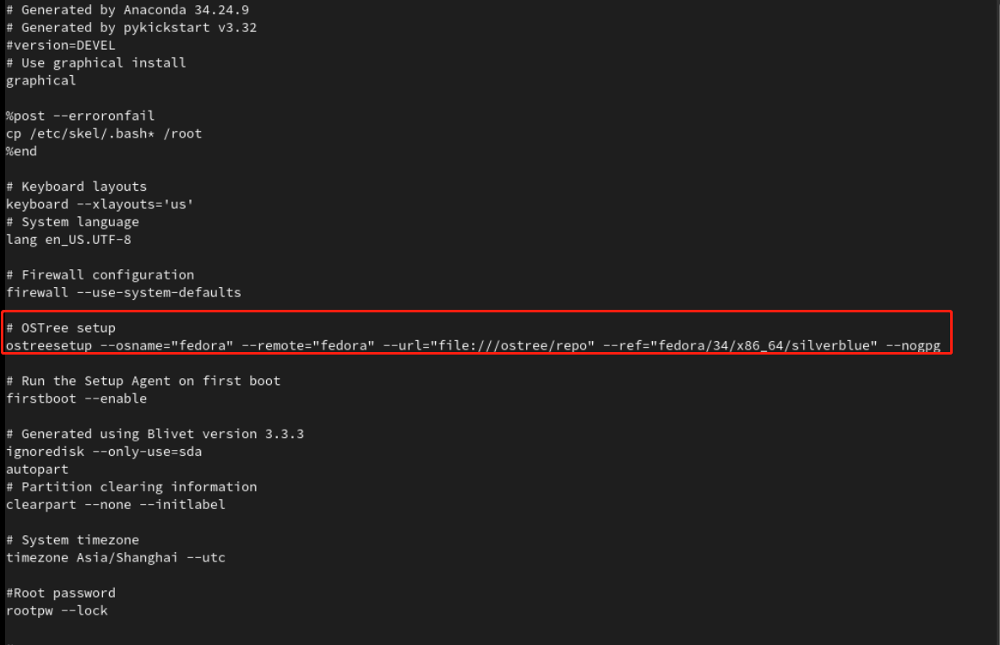

---

## OSTree
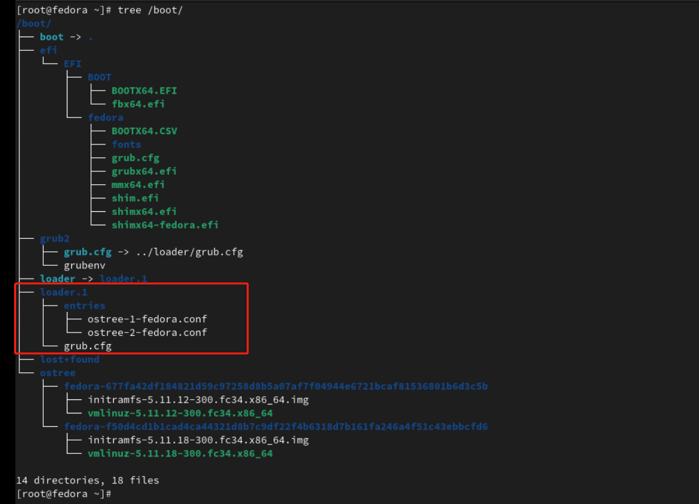

---

## OSTree
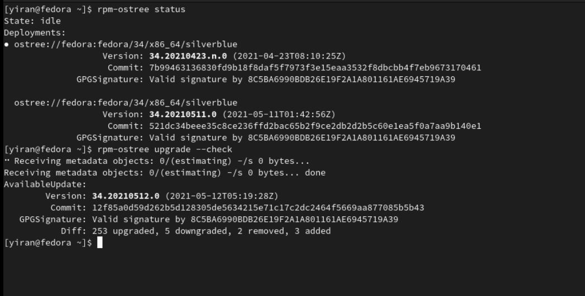

---

## OSTree
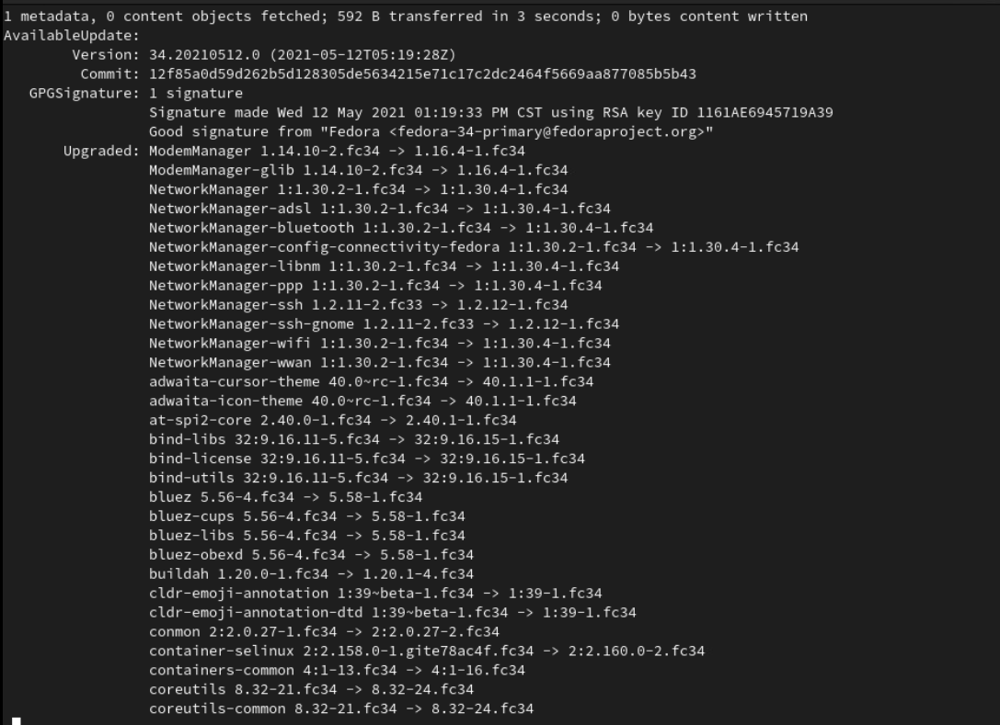

---

## OSTree
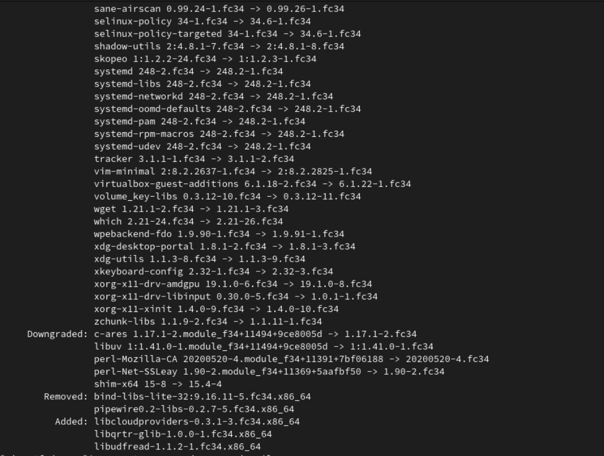

---

## OSTree
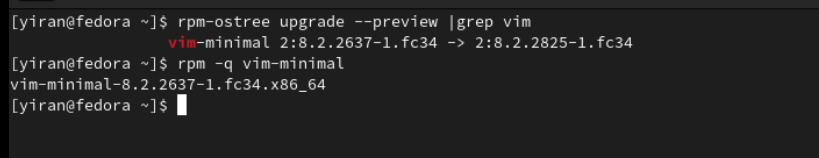


---

## OSTree
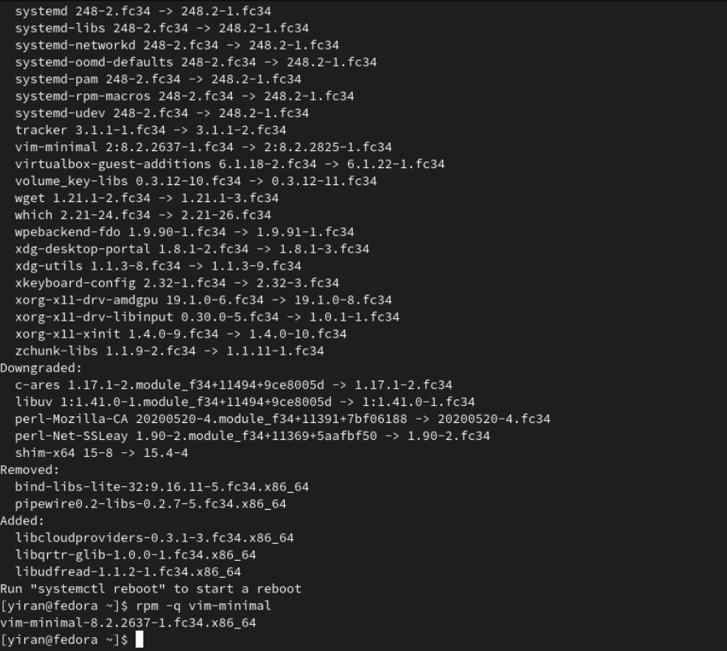

---

## OSTree
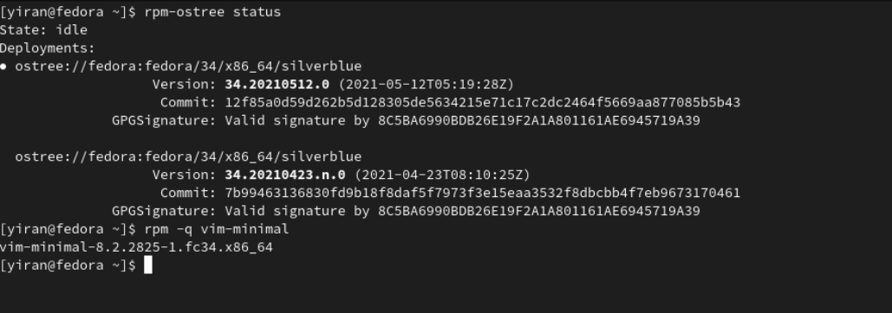

---

## OSTree
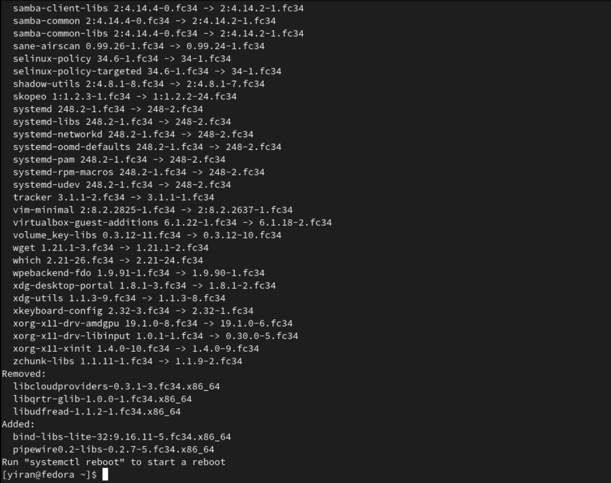

---

## OSTree
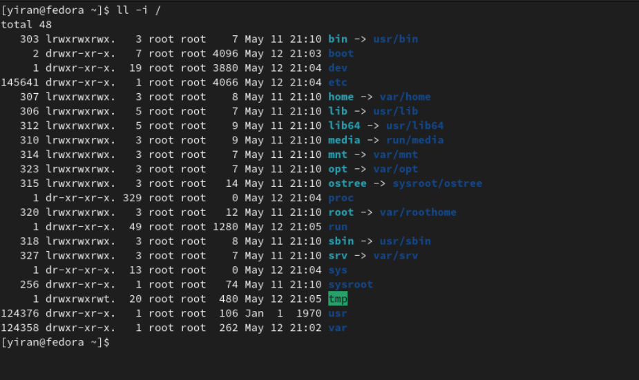


---

## OSTree
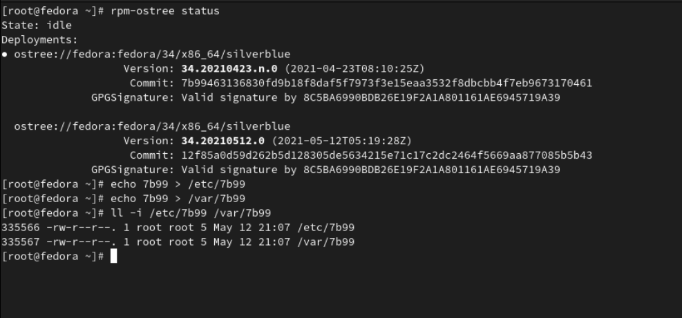


---

## OSTree
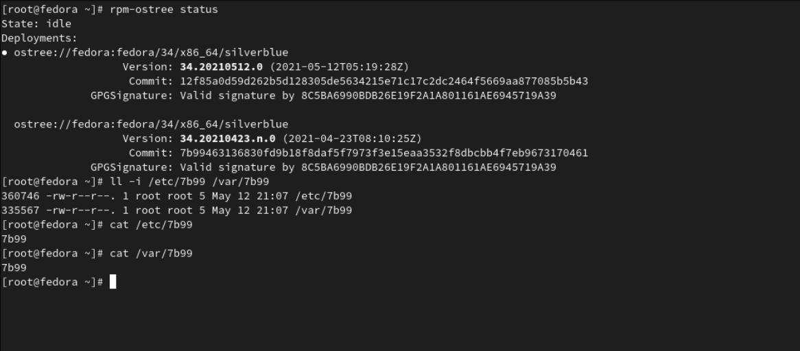


---

## OSTree
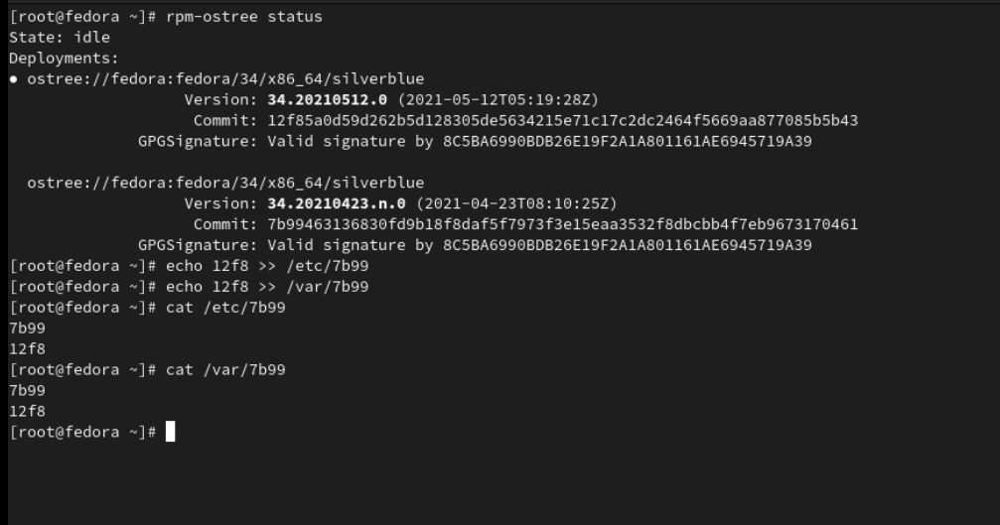


---

## OSTree
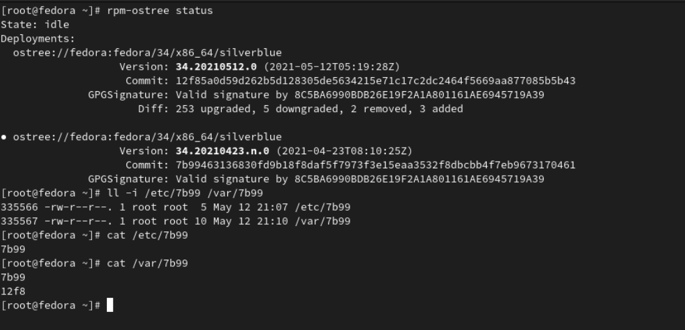

---

## OSTree


---

## OSTree
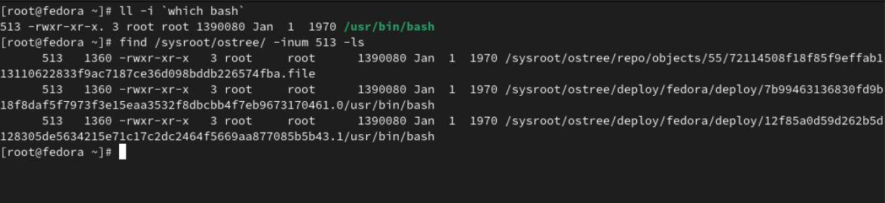

---
## 相关链接：
* https://www.softwarecollections.org/en/
* https://ostreedev.github.io/ostree/ 
* https://github.com/coreos/rpm-ostree
* https://blog.verbum.org/2020/08/22/immutable-%e2%86%92-reprovisionable-anti-hysteresis/